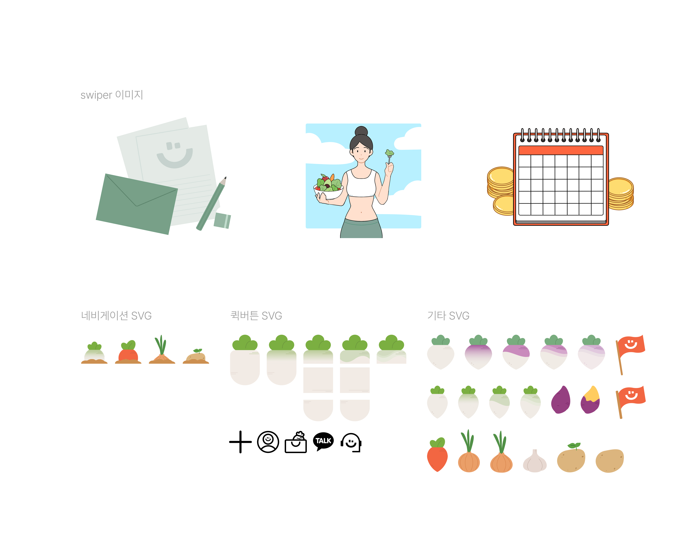

    
     
    <h1>UglyUs React Project</h1>
     
     
    

        

            친환경·유기농 농산물을 가장 저렴하게, 나와 환경, 농부에 더 이로운 식탁을 만드는 Ugly us입니다.
        
 
        

            #친환경 #유기농 #맛있는식탁 #웹페이지개선
        
 
        

            어글리어스 리액트 프로젝트는 유기농 과일·채소의 가치와 환경 보호 취지를 반영하여 제작되었습니다.  
            상품 정보, 소비자 리뷰, 협업 생산자 인터뷰 등을 효율적으로 관리하고 빠른 랜딩을 위해 React를 활용하였으며, 카카오맵 API를 적용해 생산지 위치를 직관적으로 확인할 수 있는 기능을 구현하여 브랜드의 신뢰성을 높였습니다.
        

    

 

    <h2>목차</h2>
    📌 <a href="#link">소개</a> 
    🎨 <a href="#tool">사용 툴</a> 
    💻 <a href="#environment">리액트 프로젝트 개발환경 및 사용 모듈</a> 
    🌌 <a href="#boilerplate">보일러플레이트</a> 
    🔍 <a href="#component">컴포넌트 세팅 구조</a> 
    📝 <a href="#design">디자인 시안</a> 
    🖼️ <a href="#source">자체 제작 일러스트 및 svg</a> 
    💻 <a href="#data">DB 설계</a> 

 

    <h2>📌 소개</h2>
    <ul>
        <li>😉 제작자 : 박연주</li>
        <li>📫 e-mail : yeonjuu35@gmail.com</li>
        <li>🗒 <a href="https://likeable-cowbell-bc6.notion.site/Ugly-us-React-1-fd6d570a224246279105109c605bf3e2?pvs=4">notion</a></li>
        <li>🎨 <a href="https://www.figma.com/design/P7aZshDr7dSVAY9oSO7tjP/%EC%95%BC%EC%B1%84GPT---%EB%B0%95%EC%97%B0%EC%A3%BC(%EA%B0%9C%EC%9D%B8)?node-id=100-2&t=OYWK7BxTvjz5yrYS-1">figma</a></li>
        <li>🎨 <a href="https://www.figma.com/board/aZFqGwL9VJXVVegsSOFSrl/uglyus-DFD?node-id=0-1&t=GyT92agCxoLjqprA-1">DFD & Component Diagram in figma</a></li>
        <li>📄 <a href="https://github.com/Yeonjuu35/myUglyus/blob/main/src/data/data.json">json</a></li>
    </ul>

 

    <h2>🎨 사용 툴</h2>
    <ul>
        <li>Illustrator</li>
        <li>Photoshop</li>
        <li>Clip Studio</li>
        <li>Figma</li>
        <li>VS Code</li>
        <li>React</li>
    </ul>

 

    <h2>💻 리액트 프로젝트 개발환경 및 사용 모듈</h2>
    <ul>
        <li><strong>Node.js : v18.20.3</strong></li>
        <li><strong>사용 모듈</strong></li>
        <ul>
            <li>@testing-library/jest-dom ^5.17.0</li>
            <li>@testing-library/react ^13.4.0</li>
            <li>@testing-library/user-event ^13.5.0</li>
            <li>axios ^1.7.3</li>
            <li>bootstrap ^5.3.3</li>
            <li>bootstrap-icons ^1.11.3</li>
            <li>react ^18.3.1</li>
            <li>react-bootstrap ^2.10.4</li>
            <li>react-dom ^18.3.1</li>
            <li>react-hook-form ^7.52.2</li>
            <li>react-router-dom ^6.26.0</li>
            <li>react-scripts 5.0.1</li>
            <li>sass ^1.77.8</li>
            <li>styled-components ^6.1.12</li>
            <li>swiper ^11.1.9</li>
            <li>web-vitals ^2.1.4</li>
        </ul>
    </ul>

 

    <h2>🌌 보일러플레이트</h2>
    

        <h3>📂 public</h3>
        <ul>
            <li>📂 img</li>
            <ul >
                <li>📂 각 컴포넌트별 이미지 폴더</li>
            </ul>
        </ul>
    

    

        <h3>📂 src</h3>
        <ul>
            <li>📂 components</li>
            <ul>
                <li>📂 각 컴포넌트별 폴더</li>
            </ul>
            <li>📂 data</li>
            <li>📂 font</li>
            <li>📂 scss</li>
            <ul>
                <li>📂 각 scss 파일</li>
            </ul>
        </ul>
    

 

    <h2>🔍 컴포넌트 세팅 구조</h2>
    

 

    <h2>📝 디자인 시안</h2>    
    <table align="center">
        <tr>
            <th>pc</th>
            <th>mobile</th>
        </tr>
        <tr>
            <td align="center"></td>
            <td align="center"></td>
        </tr> 
    </table>

 

    <h2>🖼️ 자체 제작 일러스트 및 svg</h2>
    

 

    <h2>💻 DB 설계</h2>
    <ul>
        <li>JSON 데이터 사용 컴포넌트</li>
        <ul>
            <li>Header.js : 메뉴가 변경될 수 있으므로 유동적인 처리가 필요합니다.</li>
            <li>MainSwiper.js : 이미지 슬라이드 및 배너 내용이 자주 변경되므로 유동적으로 처리해야 합니다.</li>
            <li>Review.js : 리뷰 내용이 추가되거나 변경될 수 있습니다.</li>
            <li>MarkeType1.js & MarkeType2.js : 마켓 상품 정보가 추가되거나 변경될 수 있습니다.</li>
            <li>Recipe.js : 채소 박스 속 채소, 채소별 추천 레시피 목록이 변경될 수 있습니다.</li>
            <li>Kakaomap.js : 생산자, 생산지, 인터뷰 내용이 추가되거나 변경될 수 있습니다.</li>
        </ul>
    </ul>
    <a href="https://github.com/Yeonjuu35/myUglyus/blob/main/src/data/data.json">🔗 JSON 데이터 바로가기 링크</a>

 
